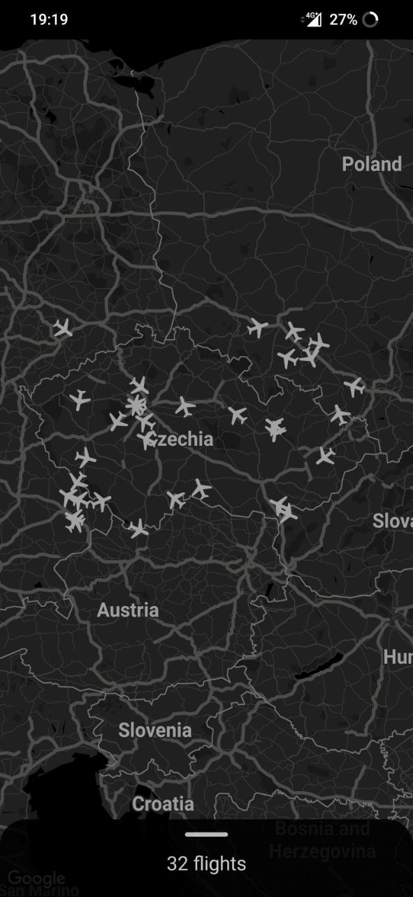
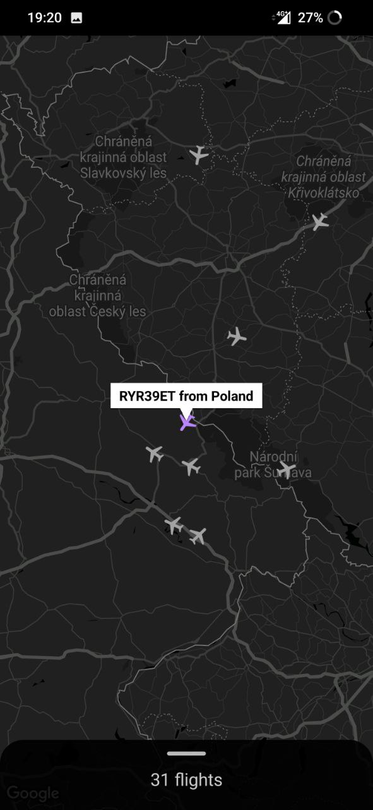
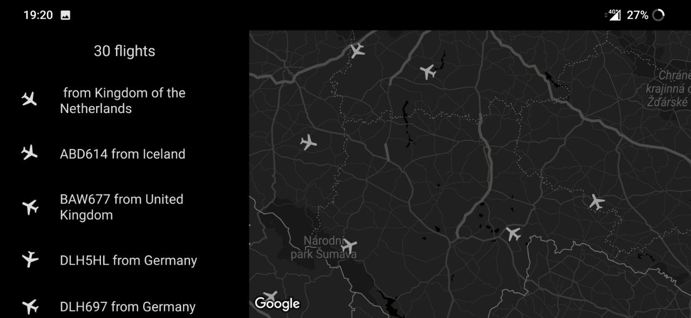

# About
"Czech Air" is an Android application with a map that shows planes flying above Czech Republic. Data updates every 10 seconds.

# Features
- Night mode support
- Landscape orientation support

# Preview:
  

# References
- https://openskynetwork.github.io/opensky-api/rest.html (API)
